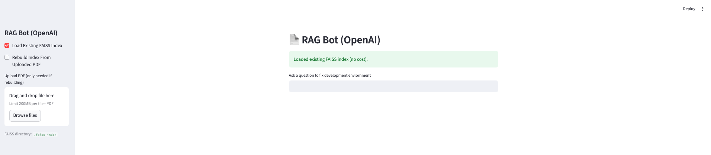

# openai-rag-chatbot
A lightweight Streamlit RAG chatbot that answers questions from your PDFs using OpenAI (gpt‑4o‑mini + text‑embedding‑3‑small) and FAISS—optimized for ultra‑low cost with a “Load vs Rebuild Index” toggle.

# RAG Bot (OpenAI)

A lightweight **Retrieval‑Augmented Generation (RAG)** chatbot built with **Streamlit**, **FAISS**, and **OpenAI**.  
Upload a PDF, build a vector index once, and ask grounded questions using **gpt‑4o‑mini** with **text‑embedding‑3-small**.

> **Why it’s special**  
> - **Ultra‑low cost**: Embeddings ~ $0.02 per **1M** tokens, one-time; chat calls are in fractions of a cent.  
> - **Zero re‑embedding by default**: “Load Existing Index” toggle avoids extra costs.  
> - **From scratch to production‑friendly**: Clean pipeline, small footprint, readable code.



---

## ✨ Features

- **RAG pipeline**: PDF → chunk → embed → FAISS → retrieve → GPT answer
- **Load vs Rebuild toggle**:
  - **Load Existing Index (default)** = no embedding cost  
  - **Rebuild Index** when you add new PDFs
- **Explainable**: swap to similarity retrieval and show sources (optional)
- **Simple UX**: Streamlit front‑end; answers limited to provided context

---

## 🧠 Models (cost‑optimized defaults)

- **Chat**: `gpt-4o-mini` (cheap and strong for QA)  
- **Embeddings**: `text-embedding-3-small` (1,536 dims; excellent $/quality)

> Pricing references (check the OpenAI pricing page for latest):
> - **Embeddings**: text‑embedding‑3‑small ≈ **$0.02 / 1M tokens** (input only).  
> - **Chat**: gpt‑4o‑mini ≈ **$0.15 / 1M input tokens**, **$0.60 / 1M output tokens**.  
>   
> A typical question costs around **$0.0003**; a 65‑page PDF often embeds for **~$0.001**.

---

## 🛠️ Quickstart

### 1) Install
```bash
python -m venv .venv && source .venv/bin/activate
pip install --upgrade pip
pip install -r requirements.txt
```
### 2) Configure
Create .env (or set env vars in your shell):
```bash
export OPENAI_API_KEY="sk-..."
export FAISS_DIR=".faiss_index"
```
### 3) Run
```bash
streamlit run rag_openai_app.py
```

## 🧩 How it works

- PDF → text: Extracted with pdfplumber.
- Chunking: RecursiveCharacterTextSplitter splits text into ~1000‑token chunks.
- Embeddings: text-embedding-3-small on first build; vectors stored in FAISS.
- Retrieval: Top‑K chunks fetched for each question.
- LLM: gpt-4o-mini answers using only the provided context.


## Architecture (Boxed Diagram)
```
+-------------------+     build      +------------------+
|  Source Docs      |  ----------->  |  Chunker         |
|  (PDF/HTML/MD)    |                |  (split & clean) |
+-------------------+                +------------------+
                                          |
                                          v
                                   +--------------+
                                   | Embedder     |
                                   | (text->vec)  |
                                   +--------------+
                                      |        |
                                      v        v
                             +--------------+  +----------------+
                             | Vector Store |  | Metadata Store |
                             | (ANN index)  |  | (filters,tags) |
                             +--------------+  +----------------+
                                      ^                 |
                                      |                 |
User Query ----> Embed ----> Search --+------ filter ---+
       \                                           
        \--------> Prompt Builder ----> LLM ----> Answer
```


## Links: 
- https://developers.openai.com/api/docs
